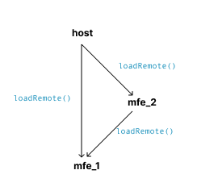

# module federation reproduction example

This reproduction example explains how it's not possible to have a dependency tree as the follows:



Issue: <https://github.com/module-federation/core/issues/3763>

## Run locally

To run execute these commands:

```
pnpm install
pnpm run -r --parallel dev
```

Will create three servers (only host one can be accessed through the browser)

- <http://localhost:1000> -> host
- <http://localhost:1001> -> mfe-1
- <http://localhost:1002> -> mfe-2
